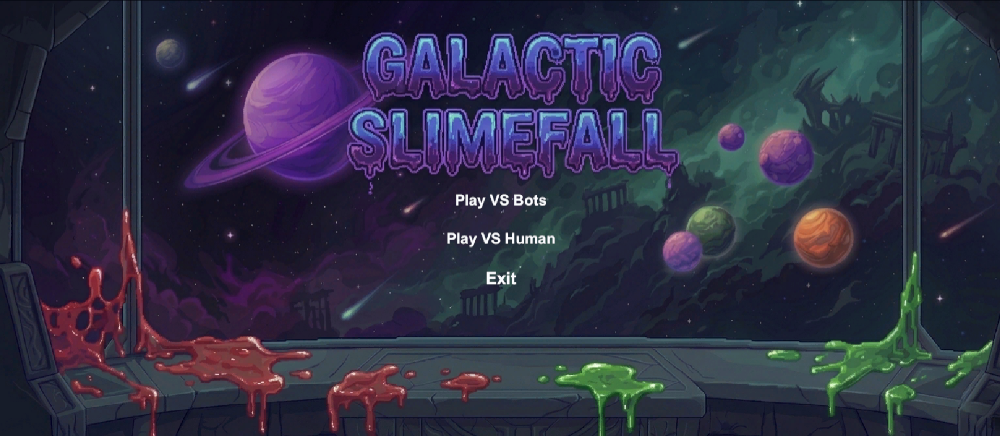
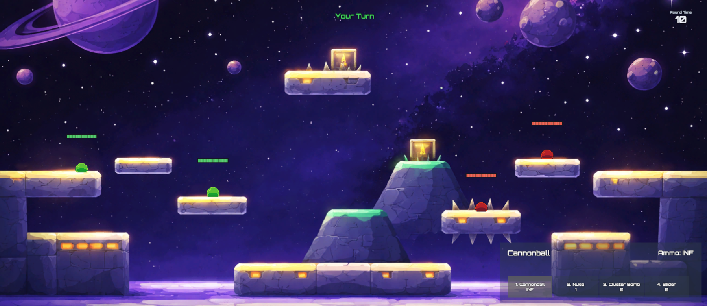

# Galactic Slimefall

Galactic Slimefall is a 2D turn-based physics artillery game inspired by **Worms W.M.D**. Two slime teams fight across a sci-fi battlefield using movement, positioning, and different projectile weapons to eliminate the opposing side.

## Overview

This project was built in **Unity 6** as a turn-based combat game focused on:
- physics-based projectile combat
- local hotseat multiplayer
- bot matches against AI enemies
- weapon variety and tactical positioning
- custom HUD, menu, and game flow systems

## Showcase

### Main Menu

### Gameplay

## Core Gameplay Loop

1. Start a turn.
2. Move and position the active slime.
3. Choose a weapon.
4. Aim and fire.
5. Resolve projectile collisions, damage, and turn switch.
6. Continue until one team is fully eliminated.

## Main Features

- **Turn-based combat** with timed rounds
- **Physics-based shooting** with force, arc, and collision
- **Multiple weapons** including Cannonball, Cluster Bomb, Roller, and Nuke
- **VS Bots** mode with projectile-based enemy AI
- **VS Human** local hotseat mode on one device
- **HUD systems** for health, timer, inventory, turn indicators, and game-over flow
- **Audio integration** for music, weapon effects, hits, jumps, and UI interaction

## Controls

### Gameplay
- **A / D**: Move
- **Space**: Jump / Double Jump
- **Mouse**: Aim
- **Left Click**: Fire
- **Mouse Wheel / Inventory**: Change weapon
- **Escape / Enter**: Pause menu

### Modes
- **VS Bots**: Fight against AI-controlled enemies
- **VS Human**: Control both teams locally in hotseat mode

## Tech Stack

- **Engine:** Unity `6000.3.5f1`
- **Language:** C#
- **Rendering:** Universal Render Pipeline (URP)
- **Input:** Unity Input System

## Project Structure

- [`Assets/GalacticSlimefall`](Assets/GalacticSlimefall): main game content
- [`Assets/GalacticSlimefall/Scenes`](Assets/GalacticSlimefall/Scenes): main scenes
- [`Assets/GalacticSlimefall/Scripts`](Assets/GalacticSlimefall/Scripts): gameplay and UI code
- [`Assets/GalacticSlimefall/Content`](Assets/GalacticSlimefall/Content): prefabs, audio, and support assets
- [`Docs`](Docs): project documentation
- [`Showcase`](Showcase): demo media

## Demo and Documentation

- **Project Documentation:** [Galactic-Slimefall-Documentation.docx](Docs/Galactic-Slimefall-Documentation.docx)
- **Gameplay Demo Video:** [Galactic-Slimefall-Demo.mp4](Showcase/Galactic-Slimefall-Demo.mp4)

## How to Open the Project

1. Open the project in **Unity 6000.3.5f1**.
2. Open [`MainMenu.unity`](Assets/GalacticSlimefall/Scenes/MainMenu.unity) to start from the full menu flow.
3. Open [`SampleScene.unity`](Assets/GalacticSlimefall/Scenes/SampleScene.unity) for direct gameplay testing.

## Development Notes

A major challenge in development was making the bot AI work in a physics-based artillery game. The AI needed to estimate projectile angle, shot force, and obstacles instead of attacking directly. Other challenges included balancing weapons, handling projectile collisions correctly, and building a clear HUD and inventory system.
